# 🛡️ AERA — Context-Aware Trip Safety Companion

**Accident & Emergency Response Assistant (AERA)** is a mobile-first trip-safety platform designed to help users stay aware of potentially unusual or risky conditions during a journey.

The application brings together **device sensor signals, location tracking, trip monitoring, contextual safety assessment, emergency contacts, incident handling, trip history, and cloud-backed persistence** within a unified mobile experience.

Built using **React Native / Expo, TypeScript and AWS serverless services**, AERA explores how mobile sensing and cloud infrastructure can work together to provide contextual safety support before, during, and after a trip.

---

## 🌍 The Idea

Most personal-safety applications focus primarily on what happens **after** a user manually requests help.

AERA approaches trip safety as a continuous journey lifecycle.

```text
Before Trip
    ↓
Start Journey
    ↓
Sensor + Location Monitoring
    ↓
Contextual Safety Assessment
    ↓
┌────────────────────────────┐
│                            │
Normal Journey        Potential Safety Event
│                            │
↓                            ↓
Continue Trip          Alert / Incident Flow
│                            │
└────────────┬───────────────┘
             ↓
          End Trip
             ↓
        Trip Summary
             ↓
     Persisted Trip Record
             ↓
        Trip History
```

Instead of treating safety as a single emergency action, AERA structures it around the complete lifecycle of a trip.

---

# ✨ Core Features

## 🚗 Trip Monitoring

AERA organizes its safety functionality around an active trip.

When a journey begins, the trip runtime coordinates:

* Trip state
* Device sensor readings
* Location updates
* Contextual safety assessment
* Alert handling
* Trip completion
* Trip summary generation
* Trip persistence

This allows trip-related behaviour to remain coordinated rather than distributing critical state across multiple screens.

---

## 📱 Device Sensor Awareness

AERA includes a dedicated sensor-collection layer that can use mobile-device motion information while a trip is active.

```text
Device Sensors
      ↓
Sensor Service
      ↓
Trip Context
      ↓
Safety Assessment
```

Sensor information becomes one part of the overall trip context.

AERA does not treat an isolated sensor reading as definitive proof that an accident or emergency has occurred.

---

## 📍 Location Tracking

Location provides additional context during a journey.

```text
Device Location
      ↓
Location Service
      ↓
Trip Context
      ↓
Trip / Incident State
```

Location information can support:

* Active trip tracking
* Trip records
* Incident context
* Safety workflows
* Emergency coordination

Location responsibilities are handled through a dedicated service instead of being implemented independently inside individual screens.

---

## 🧠 Context-Aware Safety Assessment

AERA contains an advisory inference layer for interpreting information collected during a trip.

```text
Sensor Context
      +
Location Context
      +
Trip State
      ↓
Advisory Inference
      ↓
Safety Result
```

The inference layer acts as **decision support**.

It can help surface potentially unusual conditions to the user without presenting automated inference as guaranteed accident detection.

---

## 🚨 Incident & Alert Workflow

When the safety runtime identifies a condition requiring an alert, AERA can initiate an incident workflow.

```text
Trip Runtime
      ↓
Alert Service
      ↓
API Client
      ↓
Amazon API Gateway
      ↓
Incident Lambda
     ↙       ↘
DynamoDB   Amazon SNS
```

Incident information can be persisted through the backend, while Amazon SNS provides the cloud notification path where configured.

This keeps **safety assessment**, **incident persistence**, and **alert delivery** as separate responsibilities.

---

## 👥 Emergency Contacts

Users can maintain contacts relevant to their personal-safety workflow.

```text
Contacts Screen
      ↓
API Service
      ↓
API Gateway
      ↓
Contacts Lambda
      ↓
DynamoDB
```

Cloud-backed contact management keeps contact information associated with the authenticated user instead of relying entirely on temporary screen state.

---

## 📜 Trip History

Completed trips can be persisted and later displayed through the Trip History interface.

```text
Completed Trip
      ↓
Trips API
      ↓
DynamoDB
      ↓
Persisted Trip Record
      ↓
Trip History
```

Trip History is designed around actual persisted trip state rather than static history cards.

This allows previous journeys and their associated outcomes to be represented consistently across sessions.

---

## 📊 Trip Summary

When a journey ends, AERA presents a safety-oriented trip summary.

```text
Trip Start
    ↓
Sensor + Location Context
    ↓
Safety Assessment
    ↓
Trip Completion
    ↓
Persisted Result
    ↓
Trip Summary
```

The summary provides contextual information about the completed journey and is not intended to act as a formal safety certification.

---

## 👤 Profile & Settings

AERA provides profile and settings functionality for maintaining user-level application information.

```text
Profile Settings
      ↓
API Service
      ↓
API Gateway
      ↓
Profile Lambda
      ↓
DynamoDB
```

The settings layer is designed to provide a centralized location for user-specific configuration as the platform evolves.

---

# 🔐 Authentication

AERA uses **Amazon Cognito** for cloud-backed authentication.

```text
Login
   ↓
Authentication Service
   ↓
Amazon Cognito
   ↓
Authenticated Session
   ↓
Local Token State
```

Authentication logic is separated from individual application screens through the dedicated authentication service.

This allows the rest of the application to work with authenticated session state without implementing authentication logic repeatedly.

---

# ☁️ Serverless AWS Backend

AERA uses a serverless backend architecture.

```text
React Native Application
          ↓
Amazon API Gateway
          ↓
      AWS Lambda
          ↓
    Amazon DynamoDB
```

Separate Lambda handlers manage different application domains.

| Handler       | Responsibility                          |
| ------------- | --------------------------------------- |
| **Trips**     | Trip persistence and retrieval          |
| **Contacts**  | Emergency-contact management            |
| **Profile**   | User-profile operations                 |
| **Incidents** | Incident persistence and alert workflow |

The architecture allows backend functionality to remain modular while exposing a unified API boundary to the mobile application.

---

# 🏗️ System Architecture

AERA is organized into four major layers:

**Mobile Experience → Safety Runtime → Backend API → Persistence & Cloud Integrations**

```mermaid
flowchart TD

subgraph group_mobile["Mobile Experience"]
  node_auth_ui["Auth Screens<br/>[login.tsx]"]
  node_trip_ui["Trip Screens<br/>[trip.tsx]"]
  node_result_ui["Safety Results<br/>[summary.tsx]"]
  node_contacts_ui["Contacts Screen<br/>[contacts.tsx]"]
  node_history_ui["Trip History<br/>[history.tsx]"]
  node_profile_ui["Profile Settings"]
end

subgraph group_safety["Safety Runtime"]
  node_trip_context["Trip Context<br/>[TripContext.tsx]"]
  node_sensor_service["Sensor Collection<br/>[sensorService.ts]"]
  node_location_service["Location Tracking<br/>[locationService.ts]"]
  node_inference_service["Advisory Inference"]
  node_alert_service["Alert Dispatch<br/>[alertService.ts]"]
end

subgraph group_backend["Backend API"]
  node_trips_lambda["Trips Handler<br/>[handler.ts]"]
  node_contacts_lambda["Contacts Handler<br/>[handler.ts]"]
  node_profile_lambda["Profile Handler<br/>[handler.ts]"]
  node_incidents_lambda["Incidents Handler<br/>[handler.ts]"]
  node_dynamo[("DynamoDB Tables<br/>[dynamo.ts]")]
end

subgraph group_storage["Persistence Integrations"]
  node_auth_service["Cognito Auth<br/>[authService.ts]"]
  node_api_service["API Client<br/>[apiService.ts]"]
  node_local_store_service["Storage Service<br/>[storageService.ts]"]
  node_async_store[("Local State Store")]
end

node_user(("Trip User"))
node_cognito["Amazon Cognito"]
node_api_gateway["API Gateway<br/>[aera-stack.ts]"]
node_sns["Amazon SNS"]

node_user -->|"opens"| node_auth_ui
node_auth_ui -->|"authenticates"| node_auth_service
node_auth_service -->|"requests auth"| node_cognito
node_auth_service -->|"stores tokens"| node_async_store

node_user -->|"starts trip"| node_trip_ui
node_trip_ui -->|"controls trip"| node_trip_context

node_trip_context -->|"reads sensors"| node_sensor_service
node_trip_context -->|"reads location"| node_location_service
node_trip_context -.->|"requests advice"| node_inference_service
node_trip_context -->|"updates result"| node_result_ui

node_trip_context -->|"raises alert"| node_alert_service
node_alert_service -->|"posts incident"| node_api_service
node_api_service -->|"calls API"| node_api_gateway

node_contacts_ui -->|"manages contacts"| node_api_service
node_history_ui -->|"loads trips"| node_api_service
node_profile_ui -->|"updates profile"| node_api_service

node_local_store_service -->|"reads state"| node_async_store
node_local_store_service -->|"writes state"| node_async_store

node_api_gateway -->|"dispatches trips"| node_trips_lambda
node_api_gateway -->|"dispatches contacts"| node_contacts_lambda
node_api_gateway -->|"dispatches profile"| node_profile_lambda
node_api_gateway -->|"dispatches incidents"| node_incidents_lambda

node_trips_lambda -->|"reads writes"| node_dynamo
node_contacts_lambda -->|"reads writes"| node_dynamo
node_profile_lambda -->|"reads writes"| node_dynamo
node_incidents_lambda -->|"stores incident"| node_dynamo

node_incidents_lambda -.->|"sends SMS"| node_sns

click node_auth_ui "https://github.com/rituparnaaa17/aera/blob/main/artifacts/aera/app/(auth)/login.tsx"
click node_trip_ui "https://github.com/rituparnaaa17/aera/blob/main/artifacts/aera/app/trip.tsx"
click node_result_ui "https://github.com/rituparnaaa17/aera/blob/main/artifacts/aera/app/summary.tsx"
click node_contacts_ui "https://github.com/rituparnaaa17/aera/blob/main/artifacts/aera/app/(tabs)/contacts.tsx"
click node_history_ui "https://github.com/rituparnaaa17/aera/blob/main/artifacts/aera/app/(tabs)/history.tsx"

click node_trip_context "https://github.com/rituparnaaa17/aera/blob/main/artifacts/aera/components/TripContext.tsx"
click node_sensor_service "https://github.com/rituparnaaa17/aera/blob/main/artifacts/aera/services/sensorService.ts"
click node_location_service "https://github.com/rituparnaaa17/aera/blob/main/artifacts/aera/services/locationService.ts"
click node_inference_service "https://github.com/rituparnaaa17/aera/blob/main/artifacts/aera/services/inferenceService.ts"
click node_alert_service "https://github.com/rituparnaaa17/aera/blob/main/artifacts/aera/services/alertService.ts"

click node_auth_service "https://github.com/rituparnaaa17/aera/blob/main/artifacts/aera/services/authService.ts"
click node_api_service "https://github.com/rituparnaaa17/aera/blob/main/artifacts/aera/services/apiService.ts"
click node_local_store_service "https://github.com/rituparnaaa17/aera/blob/main/artifacts/aera/services/storageService.ts"

click node_api_gateway "https://github.com/rituparnaaa17/aera/blob/main/backend/lib/aera-stack.ts"

click node_trips_lambda "https://github.com/rituparnaaa17/aera/blob/main/backend/lambda/trips/handler.ts"
click node_contacts_lambda "https://github.com/rituparnaaa17/aera/blob/main/backend/lambda/contacts/handler.ts"
click node_profile_lambda "https://github.com/rituparnaaa17/aera/blob/main/backend/lambda/profile/handler.ts"
click node_incidents_lambda "https://github.com/rituparnaaa17/aera/blob/main/backend/lambda/incidents/handler.ts"
click node_dynamo "https://github.com/rituparnaaa17/aera/blob/main/backend/lambda/shared/dynamo.ts"

classDef toneBlue fill:#dbeafe,stroke:#2563eb,stroke-width:1.5px,color:#172554
classDef toneAmber fill:#fef3c7,stroke:#d97706,stroke-width:1.5px,color:#78350f
classDef toneMint fill:#dcfce7,stroke:#16a34a,stroke-width:1.5px,color:#14532d
classDef toneRose fill:#ffe4e6,stroke:#e11d48,stroke-width:1.5px,color:#881337
classDef toneIndigo fill:#e0e7ff,stroke:#4f46e5,stroke-width:1.5px,color:#312e81

class node_auth_ui,node_trip_ui,node_result_ui,node_contacts_ui,node_history_ui,node_profile_ui,node_user toneBlue
class node_trip_context,node_sensor_service,node_location_service,node_inference_service,node_alert_service toneAmber
class node_trips_lambda,node_contacts_lambda,node_profile_lambda,node_incidents_lambda,node_dynamo,node_api_gateway toneMint
class node_auth_service,node_api_service,node_local_store_service,node_async_store toneRose
class node_cognito,node_sns toneIndigo
```



> The architecture diagram is interactive when viewed on GitHub. Core components link directly to their corresponding implementation files.

---

# 🧠 Architecture Breakdown

## 1. Mobile Experience

The mobile application provides dedicated interfaces for:

* Authentication
* Active trips
* Safety results
* Emergency contacts
* Trip history
* Profile and settings

The UI remains focused on presentation and user interaction while trip behaviour is coordinated through shared context and services.

---

## 2. Safety Runtime

The safety runtime contains the primary trip-related application logic.

```text
TripContext
   │
   ├── Sensor Service
   ├── Location Service
   ├── Advisory Inference
   └── Alert Service
```

`TripContext.tsx` coordinates the active journey and connects the user experience with the services required during a trip.

This prevents individual screens from independently managing sensor subscriptions, location tracking, alerts, and trip state.

---

## 3. API Layer

The mobile application communicates with the cloud backend through a dedicated API service.

```text
Mobile Feature
      ↓
apiService.ts
      ↓
Amazon API Gateway
      ↓
Lambda Handler
```

This API boundary separates mobile behaviour from cloud persistence and backend processing.

---

## 4. Cloud Persistence

Amazon DynamoDB stores backend application records for supported serverless workflows.

Dedicated handlers manage:

```text
Trips
Contacts
Profiles
Incidents
```

This allows persisted information to remain available beyond an individual mobile session.

---

## 5. Local Persistence

AERA also maintains device-local application state where cloud persistence is unnecessary.

```text
Application
     ↓
Storage Service
     ↓
Local State Store
```

The application can therefore combine local state with server-backed records according to the needs of each workflow.

---

# 🔄 End-to-End Trip Flow

A typical AERA journey follows:

```text
User Login
    ↓
Authenticated Session
    ↓
Start Trip
    ↓
TripContext Activated
    ↓
┌─────────────────────────────┐
│ Sensor Collection           │
│ Location Tracking           │
│ Context / Advisory Analysis │
└─────────────────────────────┘
    ↓
Safety State
   ↙   ↘
Normal  Alert Condition
  ↓          ↓
Continue   Incident Workflow
  │          ↓
  │      Backend Persistence
  │          ↓
  │       SNS Path
  │
  └──────────┐
             ↓
         End Trip
             ↓
        Trip Summary
             ↓
       Persisted Record
             ↓
        Trip History
```

---

# ☁️ AWS Architecture

AERA uses AWS services for identity, APIs, persistence, notifications, and infrastructure management.

| AWS Service            | Responsibility                                  |
| ---------------------- | ----------------------------------------------- |
| **Amazon Cognito**     | User authentication                             |
| **Amazon API Gateway** | Mobile-to-backend API boundary                  |
| **AWS Lambda**         | Serverless backend handlers                     |
| **Amazon DynamoDB**    | Trip, contact, profile and incident persistence |
| **Amazon SNS**         | Notification / SMS integration path             |
| **AWS CDK**            | Infrastructure definition                       |

---

# 🧰 Technology Stack

| Layer              | Technology                |
| ------------------ | ------------------------- |
| Mobile Application | React Native / Expo       |
| Language           | TypeScript                |
| Routing            | Expo Router               |
| Trip State         | React Context             |
| Authentication     | Amazon Cognito            |
| API                | Amazon API Gateway        |
| Backend            | AWS Lambda                |
| Database           | Amazon DynamoDB           |
| Notifications      | Amazon SNS                |
| Device Context     | Mobile sensors + location |
| Local Persistence  | Device-local storage      |
| Infrastructure     | AWS CDK                   |
| Version Control    | Git + GitHub              |

---

# 📂 Repository Structure

```text
AERA/
│
├── artifacts/
│   └── aera/
│       │
│       ├── app/
│       │   ├── (auth)/
│       │   │   └── login.tsx
│       │   │
│       │   ├── (tabs)/
│       │   │   ├── contacts.tsx
│       │   │   └── history.tsx
│       │   │
│       │   ├── trip.tsx
│       │   └── summary.tsx
│       │
│       ├── components/
│       │   └── TripContext.tsx
│       │
│       └── services/
│           ├── authService.ts
│           ├── apiService.ts
│           ├── storageService.ts
│           ├── sensorService.ts
│           ├── locationService.ts
│           ├── inferenceService.ts
│           └── alertService.ts
│
├── backend/
│   ├── lib/
│   │   └── aera-stack.ts
│   │
│   └── lambda/
│       ├── trips/
│       │   └── handler.ts
│       ├── contacts/
│       │   └── handler.ts
│       ├── profile/
│       │   └── handler.ts
│       ├── incidents/
│       │   └── handler.ts
│       └── shared/
│           └── dynamo.ts
│
├── assets/
├── lib/
├── scripts/
├── package.json
├── pnpm-workspace.yaml
└── tsconfig.json
```

---

# 🎨 Product Experience

AERA's mobile experience follows a simple principle:

> **Safety information should remain clear and accessible throughout a journey without overwhelming the user.**

The application experience is therefore organized around three stages:

```text
BEFORE TRIP
Preparation
Contacts
Profile
     ↓
DURING TRIP
Monitoring
Location
Safety Context
Alerts
     ↓
AFTER TRIP
Summary
Persisted Result
Trip History
```

This keeps the interface aligned with the user's journey rather than exposing every platform capability at once.

---

# 🛡️ Design Principles

### Context Over Individual Signals

A single motion or location reading should not automatically be interpreted as proof of an emergency.

### Advisory, Not Absolute

Automated safety assessment provides contextual assistance rather than claiming guaranteed accident or emergency detection.

### Persistent Trip State

Trip summaries and history should reflect actual completed-trip information rather than static interface values.

### Separation of Responsibilities

Sensor collection, location tracking, inference, alert dispatch, authentication, local storage, APIs, and cloud persistence are maintained as separate concerns.

### Cloud-Backed Continuity

Important trip, incident, contact, and profile information can persist beyond an individual application session.

### User-Centred Safety

The system is intended to support the user during a journey without replacing personal judgment or official emergency services.

---

# 🌟 What AERA Demonstrates

From a software-engineering perspective, AERA combines:

```text
Cross-Platform Mobile Application
            +
Device Sensors
            +
Location Tracking
            +
Trip State Management
            +
Contextual Safety Assessment
            +
Emergency Contact Management
            +
Incident Workflows
            +
Serverless AWS Backend
            +
Persistent Trip History
```

into a unified trip-oriented safety platform.

The project demonstrates concepts including:

* Mobile sensor integration
* Location-aware application design
* Stateful trip lifecycle management
* React Context coordination
* Service-layer separation
* Cloud authentication
* Serverless API architecture
* NoSQL persistence
* Incident workflows
* Local and cloud state management
* Infrastructure as Code
* Mobile-first user experience design

---

# 🚀 Future Scope

Potential extensions include:

* OpenStreetMap-based trip visualization
* Route-aware trip monitoring
* Improved background location support
* More sophisticated sensor fusion
* Configurable safety thresholds
* Offline incident queueing
* Push notifications
* Emergency-contact acknowledgement
* Battery-aware sensor sampling
* Additional accessibility features
* Multi-language support
* Expanded trip analytics
* Improved incident classification
* More extensive real-device testing

---

# ⚠️ Important Safety Notice

AERA is a **prototype trip-safety and contextual-awareness application**.

It should not be relied upon as a guaranteed accident-detection system, emergency-response service, medical device, or replacement for official emergency services.

Mobile sensor readings, GPS information, network connectivity, device permissions, inference logic, and external notification services can be incomplete, delayed, unavailable, or inaccurate.

In an actual emergency, users should contact the appropriate local emergency services directly.

---

# 👥 Project Team

AERA was developed collaboratively by a **three-member team**, bringing together the different aspects of the mobile experience, application logic, and supporting platform into a unified project.

| Team Member         | GitHub           |
| ------------------- | ---------------- |
| **Rituparna Ghosh** | `@rituparnaaa17` |
| **Akshieta**        | `@Simplyaksh18`  |
| **Saransh Dutta**   | `@saranshdutta`  |

The project reflects the team's **shared effort, coordination, iterative development, and collective ownership** throughout its design and implementation.

---

# 📈 Project Status

**Active prototype development**

Current development is focused on strengthening the reliability and consistency of the overall experience, including:

* Persisted trip-data correctness
* Trip-history accuracy
* Map and location experience
* Settings and profile flows
* Safety-runtime reliability
* Mobile UX consistency

---

# 🤝 Collaboration

AERA has been developed through collaborative and iterative development across the three-member project team.

The repository represents the combined work of the team, with features continuously reviewed, integrated, and refined as the application evolves.

For proposed changes or improvements, please open an issue or discuss the change with the project team before making substantial architectural modifications.

---

# 📄 License

Add the project's selected license here if/when one is formally included in the repository.

---

# 🛡️ AERA

### Context-aware safety for every journey.

**Trip Monitoring · Sensor Awareness · Location Context · Emergency Support · Serverless AWS**

---

**Built collaboratively by the team Overclocked.**
